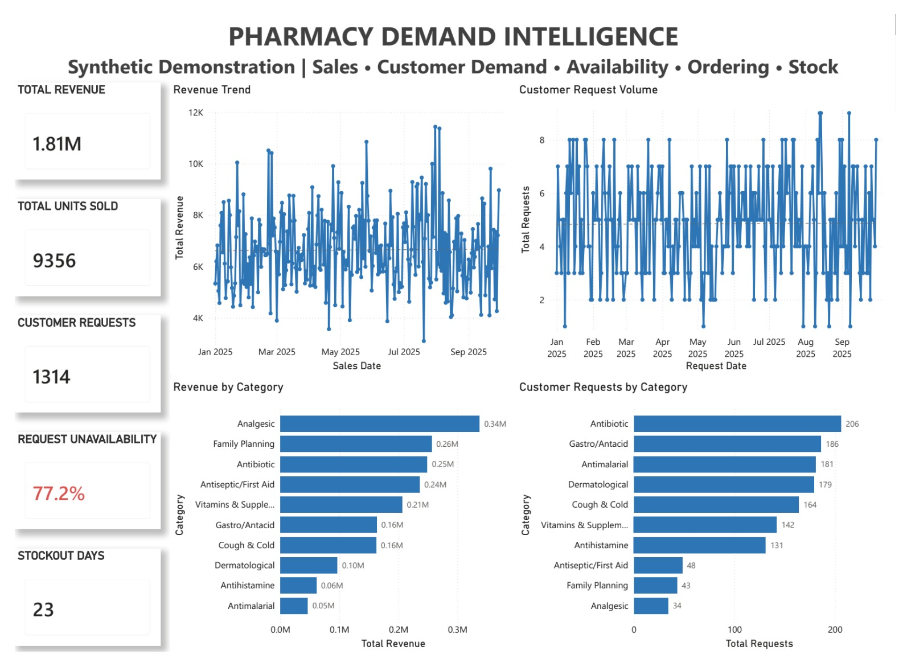
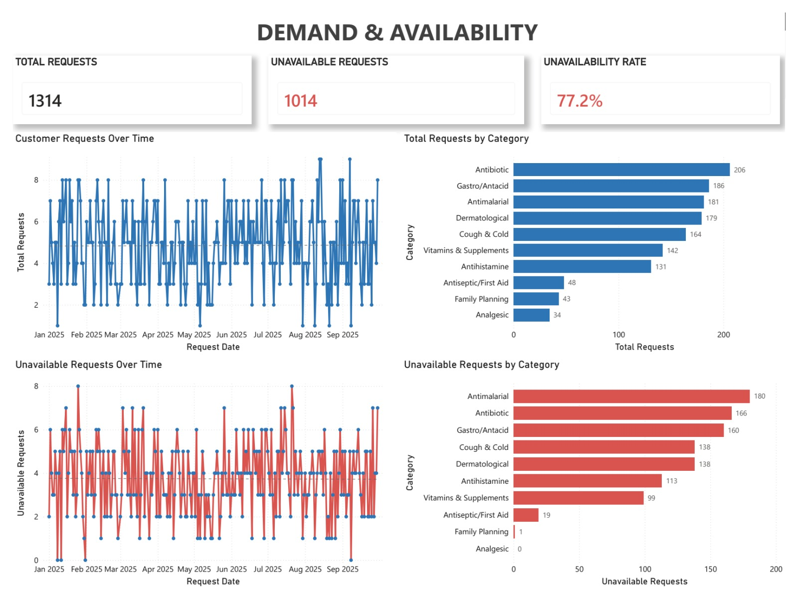
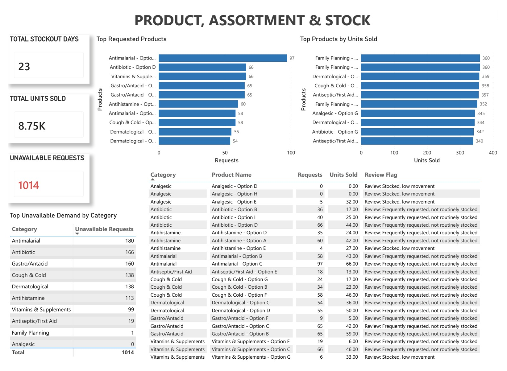
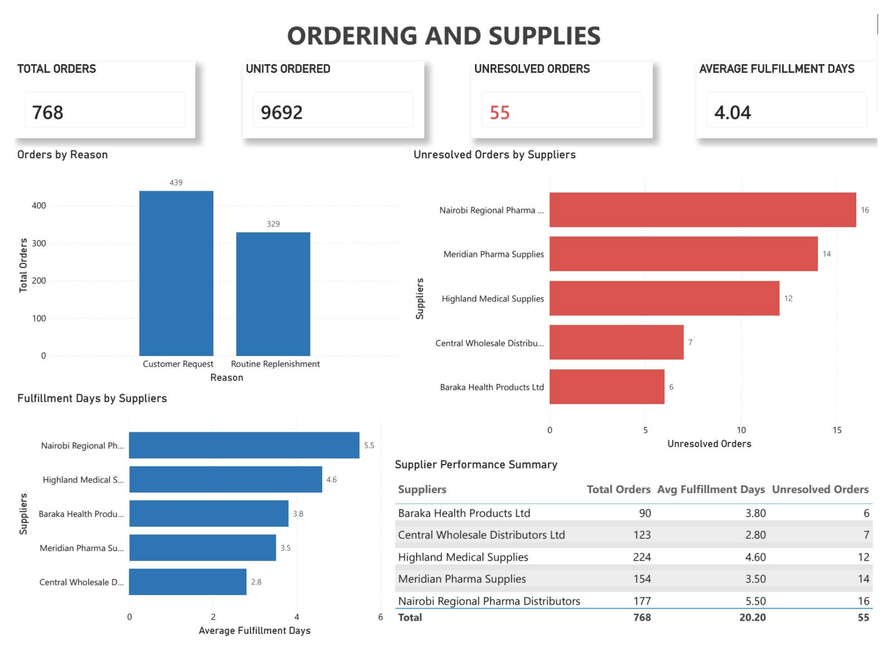
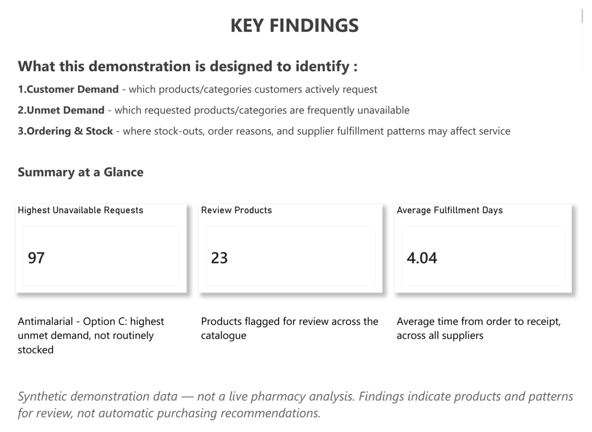

# Pharmacy Operations & Demand Intelligence — Synthetic Demonstration

📄 **[Read the full project plan →](01_project_plan.md)**

Exploring sales, product availability, ordering patterns and customer 
demand using synthetic operational data.

## ⚠️ Important
This is a SYNTHETIC DEMONSTRATION, not a real pharmacy analysis. All 
data is fictional and does not represent any real business or customers.

## Overview
A synthetic pharmacy operations analytics demonstration exploring how 
sales, customer requests, product availability, stockouts and ordering 
patterns can be combined to support better operational decisions.

**Core question:** sales alone don't capture true demand. This project 
tests what happens when you also track customer requests — including 
the ones that never became a sale.

## Data & Tools
- **Data:** Synthetic | Period: Jan–Sep 2025
- **Tools:** Python (Pandas) · MySQL · Power BI

## Dashboard Screenshots

### Executive Overview

### Demand & Availability

### Product, Assortment & Stock

### Ordering & Supplies

### Key Findings

## Key Finding (Example)
**Antimalarial – Option C:** 97 requests, not routinely stocked — the 
highest unmet-demand signal in the dataset. This flags a product for 
review, not an automatic stocking decision.

## Project Structure
- `01_project_plan.md` — full technical specification
- `02_data/` — synthetic raw & clean CSVs, MySQL load script, data dictionary
- `03_sql/` — database setup, data quality checks, analytical views
- `04_python/` — data generation and quality-check notebooks
- `05_powerbi/` — dashboard file (.pbix) and PDF export
- `06_screenshots/` — dashboard page images (used above)
- `07_showcase/` — final presentation deck (Canva PDF)

## Full Documentation
See [01_project_plan.md](01_project_plan.md) for the complete technical 
specification — data model, business rules, SQL views, DAX measures, 
validation checklist, and pharmacist walkthrough script.

## Author
Brian Mtepe Kombo, KRCHN — Healthcare Data Analytics | Health Informatics
[LinkedIn] · [GitHub]
